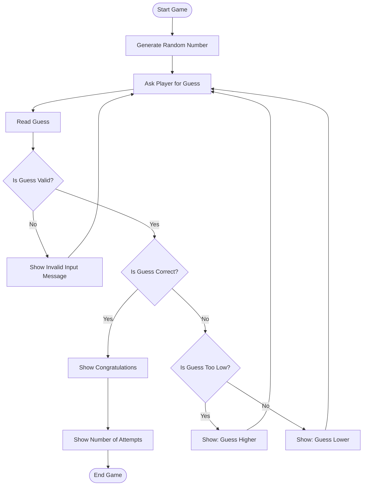
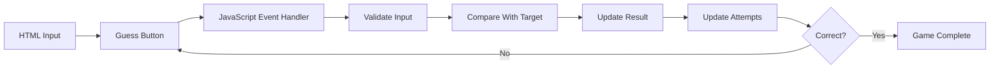

# Guessing Game Project

## Project Overview

This project is a simple **number guessing game**. The player tries to guess a randomly generated number, and the game gives hints until the correct number is found.

The project can later be converted from Python into **JavaScript + HTML + CSS** so the same game logic can run in a web browser.

## Main Features

- Generate a random number.
- Accept the player's guess.
- Check whether the guess is correct.
- Tell the player if the guess is too high or too low.
- Count the number of attempts.
- Stop when the correct number is guessed.
- Display the final result.

## Game Flow Diagram



## Basic Logic

```text
START
  |
  v
Generate random number
  |
  v
Ask user for a guess
  |
  v
Is the input valid?
  |------ No ------> Show error ------> Ask again
  |
 Yes
  |
  v
Is the guess correct?
  |------ Yes ------> Show success
  |                       |
  |                       v
  |                 Show attempts
  |                       |
  |                       v
  |                      END
  |
 No
  |
  v
Is guess lower than target?
  |------ Yes ------> Tell user to guess higher
  |
  No
  |
  v
Tell user to guess lower
  |
  v
Ask for another guess
```

## Python Version Concept

The original Python project can be organized around these steps:

1. Generate the target number using a random-number function.
2. Get input from the player.
3. Convert the input into a number.
4. Compare the player's guess with the target.
5. Display a hint.
6. Increase the attempt counter.
7. Repeat until the player guesses correctly.

## JavaScript Conversion Plan

When converting this project to a web application:

| Python | JavaScript / Web |
|---|---|
| `random` | `Math.random()` |
| `input()` | HTML input element |
| `print()` | DOM text / `textContent` |
| `while` loop | Game function + event handler |
| Python variables | JavaScript variables |
| Terminal output | HTML UI |
| User input validation | JavaScript validation |

### Suggested Web Structure

```text
guessing-game/
├── index.html
├── style.css
├── script.js
└── README.md
```

### Responsibility of Each File

**index.html**
- Game title
- Number input
- Guess button
- Hint/result area
- Attempt counter

**style.css**
- Page layout
- Buttons
- Input styling
- Result message styling

**script.js**
- Generate target number
- Read the player's guess
- Validate input
- Compare the guess
- Show hints
- Count attempts
- Restart the game

## JavaScript Logic Flow



## Future Improvements

- Add a **Play Again** button.
- Add difficulty levels such as Easy, Medium, and Hard.
- Add a maximum number of attempts.
- Add score calculation.
- Add a timer.
- Store the best score in browser storage.
- Add responsive mobile-friendly UI.
- Add animations and sound effects.

## Project Goal

The main goal is to understand how the same programming logic can move from a **Python console application** to a **JavaScript web application**.

The important part is that the **game logic can be recreated in JavaScript**. The Python code itself does not normally run directly inside a standard browser page; instead, its logic is translated/reimplemented in JavaScript.

---

**Project:** Guessing Game  
**Documentation:** Flow diagram + Python-to-JavaScript conversion plan  
**Format:** Markdown
